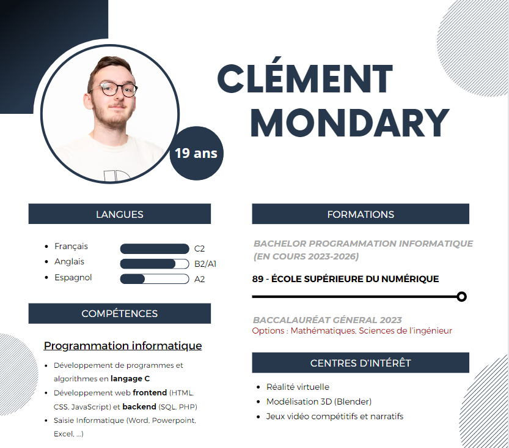

# Bonjour 👋
Je suis Clément, un jeune développeur débutant qui étudie la programmation informatique à l'<a href="https://www.ecole-89.com">École 89</a> de Ferrières-en-Brie. Je vous propose à travers ce readme de faire un tour de mes compétences et de mes mailleurs projets.

# À propos de moi...

# Mes meilleurs projets :
- Projet "Maze" en language C : [--> Maze <--](https://git.ecole-89.com/clement.mondary/2023_maze)
- Projet "LoL Champs Doc" en HTML, CSS, JavaScript : [--> LoL Champs Doc <--](https://github.com/Ecole89-B1-2023-2024/LoL_API_Clement_MONDARY)
